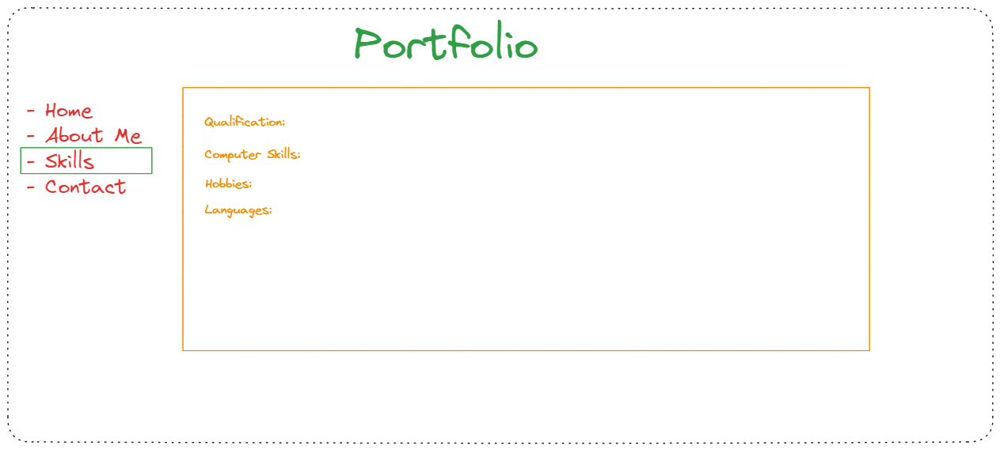
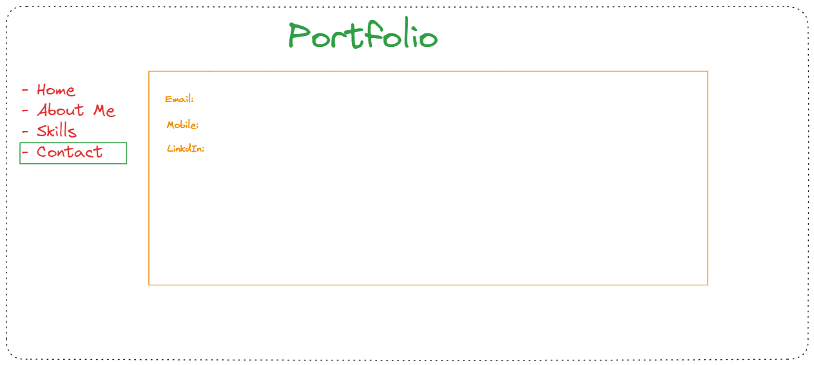

# Design

## Project's design overview

> Give an overview of your project's design

- Project has 4 webpages

  - Home: This page is the landing page which give access to other pages of the
    website. (../img/home.png)

  

  - About: This page includes all the details about me.

- Skills: all the skills are include in this page.

- Contact: Contact details are added in this page.
  

---

## Wireframe(s)

> Include your wireframe(s) and link to wireframe

<!-- provide a link to your wireframe documenting on Figma, or wherever it is -->
